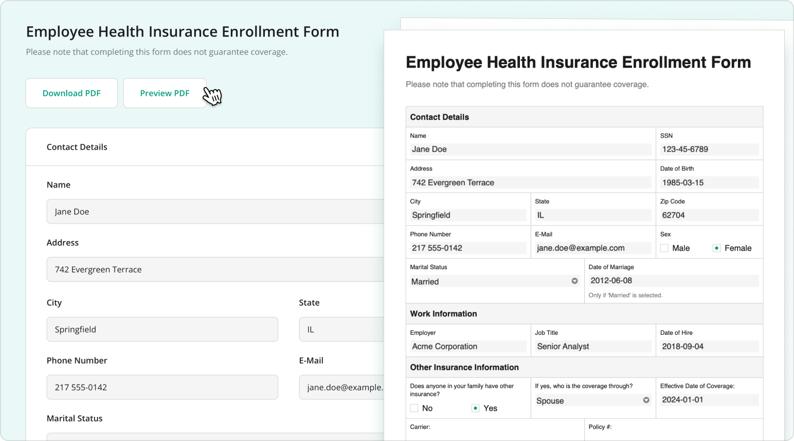

# SurveyJS PDF Generator Overview

SurveyJS PDF Generator is a JavaScript library for generating editable and read-only PDF documents from SurveyJS JSON form definitions. Use it to create fillable PDF forms for offline completion, export completed forms and survey results, or produce printable copies of blank forms.

PDF Generator uses the same JSON form definition as [SurveyJS Form Library](/form-library/documentation/overview). It supports React, Angular, Vue, and plain JavaScript applications and can generate PDF files entirely in the browser or on a Node.js server. Form definitions and response data are processed locally and do not need to be sent to SurveyJS.



## How PDF Generator Works

SurveyJS PDF Generator creates a PDF document from a SurveyJS JSON form definition. You can generate a blank form or populate it with collected response data before export.

A typical workflow is as follows:

1. Create or load a SurveyJS JSON form definition.
2. Instantiate a `SurveyPDF` model from the form definition.
3. Optionally assign collected response data to the model.
4. Configure the document format, appearance, layout, and rendering behavior.
5. Generate an editable PDF form or a static, read-only document.
6. Download the PDF in the browser or generate it on a Node.js server.

Because PDF Generator extends the survey model from `survey-core`, it uses the same form structure, conditional visibility, expressions, localization, and value formatting as Form Library. The same JSON definition can be created in [Survey Creator](/survey-creator/documentation/overview), rendered as a web form, and exported as a PDF without maintaining a separate document schema.

## Key Features

### PDF Generation and Export

- Generate PDF documents from SurveyJS JSON form definitions
- Export blank forms or forms populated with response data
- Create editable AcroForm documents for offline completion
- Create read-only PDFs for printing, archiving, or sharing completed responses
- Generate PDFs in the browser or on a Node.js server
- [Save files directly or obtain PDF content as a Blob, Base64 string, or another supported output format](/pdf-generator/examples/convert-pdf-form-blob-base64-raw-pdf-javascript/)
- Insert automatic page breaks based on the document layout

### Form Content and Rendering

- Render all built-in SurveyJS question types with documented PDF-specific limitations
- Render multi-page forms, Panels, Matrices, Dynamic panels, and other complex form structures
- [Add headers and footers to generated forms](/pdf-generator/examples/customize-header-and-footer-of-pdf-form/)
- Render supported Markdown and HTML content
- [Export custom question types and third-party components through custom PDF rendering](/pdf-generator/documentation/export-custom-components)

### PDF Appearance and Layout

- Apply SurveyJS themes to align PDF colors, shadows, and other theme-level properties with web forms
- Use shared `--sjs2-*` design tokens across SurveyJS web and PDF outputs
- [Control PDF-specific spacing, sizing, typography, borders, and corner radius through layout presets](https://surveyjs.io/pdf-generator/documentation/pdf-appearance-customization#customize-a-layout)
- Use the Compact layout preset to reduce page count or the Spacious preset to improve readability
- Customize individual elements through the Styles Config API
- [Configure page size, orientation, margins, fonts, and compression](https://surveyjs.io/pdf-generator/documentation/customize-pdf-form-settings)
- Add custom branding to document headers, footers, and form content

The theme and layout systems are independent. A theme defines shared visual properties such as colors and elevation, while a PDF layout controls document-specific properties such as spacing and typography. This separation lets web forms and PDF documents use the same visual identity while retaining layouts suited to their respective formats. See [PDF Appearance Customization](/pdf-generator/documentation/pdf-appearance-customization) for details.

### Editable and Read-Only PDF Documents

By default, PDF Generator creates an interactive AcroForm that respondents can complete offline in a compatible PDF viewer. Set the `readOnly` property to `true` to generate a static PDF instead. See [Customize PDF Form Settings](/pdf-generator/documentation/customize-pdf-form-settings) for available options.

### Localization

- Generate PDFs in any locale supported by the form definition
- Preserve translated questions, choices, descriptions, and other form content
- Apply localized value formatting from the survey model
- Embed custom fonts for languages and character sets not covered by the default font
- Support right-to-left form content with the applicable PDF configuration

### Existing PDF Form Integration

PDF Generator also includes the `pdf-form-filler` module for transferring SurveyJS response data into an existing PDF form template.

This workflow differs from generating a document with `SurveyPDF`: `SurveyPDF` creates a new PDF from a SurveyJS JSON form definition, while `pdf-form-filler` maps collected responses to fields in an existing PDF. Use it when an organization already has a standardized PDF template that must remain unchanged.

See [Fill a PDF Form with Web Form Responses](/pdf-generator/documentation/fill-pdf-form-with-web-form-responses) for implementation details.

Explore the [PDF Generator demos](/pdf-generator/examples/) with editable source code for document generation, appearance customization, headers and footers, and other export scenarios.

## Installation

Install SurveyJS PDF Generator using npm:

```
npm install survey-pdf
```

Then follow the setup guide for your framework or runtime:

- [React](/pdf-generator/documentation/get-started-react)
- [Angular](/pdf-generator/documentation/get-started-angular)
- [Vue.js](/pdf-generator/documentation/get-started-vue)
- [Plain JavaScript](/pdf-generator/documentation/get-started-html-css-javascript)
- [Node.js](/pdf-generator/documentation/get-started-nodejs)

## Package Architecture

The `survey-pdf` package extends the framework-independent survey model from `survey-core` and uses [jsPDF](https://github.com/parallax/jsPDF) to generate PDF documents.

`survey-core` provides the form model, conditional logic, expressions, localization, and value formatting. PDF Generator interprets that model and renders it as PDF content instead of HTML. Because PDF generation does not depend on a framework-specific UI renderer, the same package works with React, Angular, Vue, plain JavaScript, and Node.js applications.

PDF Generator can generate files in the browser or on a Node.js server. In both cases, your application controls how form definitions and response data are stored, retrieved, secured, and processed.

## PDF Rendering Limitations

PDF and browser layouts use different rendering models. The following limitations apply to generated PDF documents:

- Dynamic browser behavior such as validation feedback and navigation buttons is not included in PDF output.
- Element widths are calculated at an implied screen resolution of 72 dpi.
- Text questions support the `text`, `password`, and `color` input types.
- Radiogroup questions do not support individual read-only choices.
- Image Picker questions always use `"fill"` for `imageFit`.
- HTML questions support a restricted subset of HTML.
- Panels cannot be collapsed.
- Dynamic panels support the `"list"` display mode and cannot be collapsed.

See [Question Rendering in PDF Forms](/pdf-generator/documentation/question-rendering) for PDF-specific rendering behavior and supported configurations.

## Releases and Updates

Visit the [Major Updates](/stay-updated/major-updates/2025-2026), [Release Notes](/stay-updated/release-notes), and [Roadmap](/stay-updated/roadmap) pages for recent features, fixes, and planned improvements.

For major-version upgrades, refer to the relevant [migration guide](/stay-updated/migration-guides).

## Licensing

SurveyJS PDF Generator requires a [commercial license](/licensing) for production use. A developer license is required for each software developer who works with the SurveyJS PDF Generator APIs or implements its integration.
