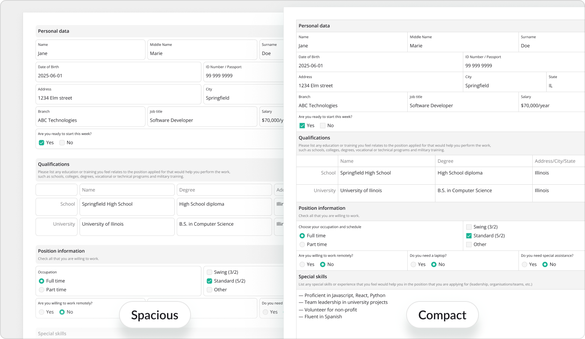

# PDF Appearance Customization

SurveyJS PDF Generator allows you to customize the appearance of generated PDF forms using themes, layouts, and styles config APIs:

- **Themes** &ndash; Define colors and shadows
- **Layouts** &ndash; Define spacing, sizing, typography, border radius, and other dimensional properties
- **Styles config** &ndash; Fine-tune and dynamically customize the appearance of individual survey elements

These customization mechanisms operate at different levels and are designed to complement each other:

- Themes define the document's visual identity.
- Layouts define structural density and proportions.
- Styles config applies targeted appearance overrides to specific element types or individual elements.

## Themes

Like other SurveyJS components, PDF Generator supports customization using UI themes. However, unlike UI components rendered in the browser, PDF Generator applies only color and shadow settings from a theme. Dimensional properties such as spacing, sizing, and typography are configured separately using [layouts](#layouts).

SurveyJS includes a print-optimized theme called Monochrome Light. This theme uses high-contrast black and white colors designed to produce clear printed output even when printer ink levels are low.

If your primary use case is printing, apply the Monochrome Light theme as shown below:

```js
// Modular applications
import { MonochromeLight } from "survey-core/themes";

const surveyPdf = new SurveyPDF({ /* ... */ });
surveyPdf.applyTheme(MonochromeLight);
```

```html
<!-- Classic script applications -->
<head>
  <!-- ... -->
  <script src="https://unpkg.com/survey-core/themes/monochrome-light.min.js"></script>
  <!-- ... -->
</head>
<body>
  <script>
    const surveyPdf = new SurveyPDF.SurveyPDF({ /* ... */});
    surveyPdf.applyTheme(SurveyTheme.MonochromeLight);
  </script>
</body>
```

Other principles of working with UI themes are shared across all SurveyJS products and are described in the following help topic:

[Themes](/documentation/themes-and-custom-styles (linkStyle))

## Layouts

Layouts are configuration objects that define dimensional appearance properties for generated PDF forms. These properties are implemented as CSS variables and include spacing, sizing, typography, border radius, and other non-color settings.

Layouts allow you to adapt PDF output for different scenarios. For example, you can optimize generated documents for compact printing, reduce page count, or improve readability in presentation-oriented forms.

### Apply a Predefined Layout

PDF Generator includes the following predefined layouts:

- Compact         
A dense layout optimized for reduced page count and data-heavy forms.

- Spacious          
A layout with increased spacing and larger visual proportions optimized for readability and presentation.



The Compact layout is applied by default. To use the Spacious layout, import it or reference its script and call the [`applyLayout`](/pdf-generator/documentation/api-reference/surveypdf#applyLayout) method:

```js
// Modular applications
import { Spacious } from "survey-pdf/layouts";

const surveyPdf = new SurveyPDF({ /* ... */});
surveyPdf.applyLayout(Spacious);
surveyPdf.save();
```

```html
<!-- Classic script applications -->
<head>
  <!-- ... -->
  <script src="https://unpkg.com/survey-pdf/layouts/spacious.min.js"></script>
  <!-- ... -->
</head>
<body>
  <script>
    const surveyPdf = new SurveyPDF.SurveyPDF({ /* ... */});
    surveyPdf.applyLayout(DocLayout.Spacious);
    surveyPdf.save();
  </script>
</body>
```

### Customize a Layout

PDF layouts use CSS variables to define document dimensional properties. To learn more about the SurveyJS customization system based on CSS variables, refer to the following help topic:

[Design Tokens &mdash; CSS-Based Customization](/documentation/design-tokens-css-customization (linkStyle))

To customize a PDF layout, create an object that defines the required [PDF layout CSS variables](/documentation/design-tokens-css-customization#pdf-layout-tokens) and pass it to the `applyLayout` method:

```js
const customLayout = {
  // Override the default font family
  "--sjs2-typography-font-family-text": "Noto Serif",

   // Override the border width used for questions
  "--sjs2-pdf-border-width-question": "var(--sjs2-border-width-x200)"
};

const surveyPdf = new SurveyPDF({ /* ... */});

surveyPdf.applyLayout(customLayout);
surveyPdf.save();
```

By default, customizations are applied on top of the Compact layout. To customize the other predefined layout, pass its configuration object as the second parameter. Both layout objects are deep-merged, and the result is applied to the generated PDF document:

```js
import { Spacious } from "survey-pdf/layouts";

const customLayout = { /* ... */ };
const surveyPdf = new SurveyPDF({ /* ... */});

surveyPdf.applyLayout(customLayout, Spacious);
surveyPdf.save();
```

### Switch Between Layouts

To switch between layouts at runtime, import layout configuration objects or reference the layout index script and apply the currently selected layout with the `applyLayout` method:

```js
// Modular applications
import { Compact, Spacious } from "survey-pdf/layouts";

// ...
surveyPdf.applyLayout(Compact);
surveyPdf.save();
```

```html
<!-- Classic script applications -->
<head>
  <!-- ... -->
  <script src="https://unpkg.com/survey-core/layouts/index.min.js"></script>
  <!-- ... -->
</head>
<body>
  <script>
    // ...
    surveyPdf.applyLayout(DocLayout.Compact);
    surveyPdf.save();
  </script>
</body>
```

## Styles Config

While themes and layouts define the overall appearance of a PDF form, the styles config API allows you to customize the appearance of specific survey elements.

The styles config system exposes a hierarchical [`style`](/pdf-generator/documentation/api-reference/surveypdf#style) object whose properties correspond to survey element types. Style properties map to visual parameters such as colors, typography, borders, spacing between titles, descriptions, and content, element indentation, etc.

You can apply styles globally for all elements of a given type or dynamically customize individual elements during PDF generation.

### Customize Type-Wide Styles

The top-level properties of the style object correspond to SurveyJS element types, including [`survey`](/pdf-generator/documentation/api-reference/idocstyle#survey), [`page`](/pdf-generator/documentation/api-reference/idocstyle#page), [`panel`](/pdf-generator/documentation/api-reference/idocstyle#panel), [`question`](/pdf-generator/documentation/api-reference/idocstyle#question), [`dropdown`](/pdf-generator/documentation/api-reference/idocstyle#dropdown), [`radiogroup`](/pdf-generator/documentation/api-reference/idocstyle#radiogroup), and others. Each property contains styles applied to all elements of the corresponding type. The [`question`](/pdf-generator/documentation/api-reference/iquestionstyle) style acts as a fallback for all question types unless overridden by a more specific question type style.

To customize type-wide styles, define an object with the properties you want to override and pass it to the [`applyStyle(style)`](/pdf-generator/documentation/api-reference/surveypdf#applyStyle) method of `SurveyPDF`. The following example increases the gap between the header (title and description) and content for all Radio Button Group questions and assigns different title colors to surveys, pages, and panels:

```js
import { SurveyPDF } from "survey-pdf";

const surveyJson = { /* Survey JSON schema */ };
const pdfDocOptions = { /* PDF document settings */ };
const surveyPdf = new SurveyPDF(surveyJson, pdfDocOptions);
surveyPdf.data = { /* Survey data to populate the document with */ }

surveyPdf.applyStyle({
  radiogroup: {
    spacing: { choiceGap: 10 }
  },
  survey: {
    title: { fontColor: "#1F3A5F" }
  },
  page: {
    title: { fontColor: "#3F5F8A" }
  },
  panel: {
    title: { fontColor: "#6F86A6" }
  }
});

surveyPdf.save();
```

### Create Theme-Aware Styles

If styles should depend on the active UI theme, pass a callback function to `applyStyle()` instead of a static object. This function provides access to two helper functions&mdash;`getSizeVariable(name)` and `getColorVariable(name)`&mdash;which allow you to derive dimensions and colors from the current theme variables:

```js
surveyPdf.applyStyle(({ getSizeVariable, getColorVariable }) => {
  return {
    radiogroup: {
      spacing: {
        choiceGap: getSizeVariable("--sjs2-base-unit-spacing") * 1.1
      }
    },
    survey: {
      title: {
        fontColor: getColorVariable("--sjs2-palette-gray-800")
      }
    },
    page: {
      title: {
        fontColor: getColorVariable("--sjs2-palette-gray-600")
      }
    },
    panel: {
      title: {
        fontColor: getColorVariable("--sjs2-palette-gray-400")
      }
    }
  }
});
```

This approach helps maintain visual consistency between SurveyJS UI themes and generated PDF forms.

### Customize Individual Element Styles

In addition to type-wide styles, you can customize individual pages, panels, questions, and choice items during PDF generation using the following events:

- [`onGetPageStyle`](/pdf-generator/documentation/api-reference/surveypdf#onGetPageStyle)
- [`onGetPanelStyle`](/pdf-generator/documentation/api-reference/surveypdf#onGetPanelStyle)
- [`onGetQuestionStyle`](/pdf-generator/documentation/api-reference/surveypdf#onGetQuestionStyle)
- [`onGetItemStyle`](/pdf-generator/documentation/api-reference/surveypdf#onGetItemStyle)

Each event provides access to the element being rendered and its style object. You can modify this object using dot notation to control how the element appears in the exported PDF.

In the following example, the choices of the "Select a color" question are rendered using the color they represent:

```js
import { SurveyPDF } from "survey-pdf";

const surveyJson = {
  "pages": [
    {
      "name": "page1",
      "elements": [
        {
          "type": "radiogroup",
          "name": "colors",
          "title": "Select a color",
          "choices": [
            { "value": "red", "text": "Red" },
            { "value": "green", "text": "Green" },
            { "value": "blue", "text": "Blue" }
          ]
        }
      ]
    }
  ]
};

const pdfDocOptions = { /* PDF document settings */ };

const surveyPdf = new SurveyPDF(surveyJson, pdfDocOptions);

surveyPdf.data = { /* Survey data */ }

surveyPdf.onGetItemStyle.add((_, options) => {
  if (options.question.name === "colors") {
    options.style.choiceText.fontColor = options.item.value;
    options.style.input.fontColor = options.item.value;
    options.style.input.borderColor = options.item.value;
  }
});

surveyPdf.save();
```

These events also expose the `getSizeVariable(name)` and `getColorVariable(name)` helper functions, which allow individual element styles to stay synchronized with the active theme:

```js
surveyPdf.onGetItemStyle.add((_, options) => {
  if (options.question.name === "colors") {
    const color = options.getColorVariable(
      "--sjs2-palette-" + options.item.value + "-600"
    );
    options.style.choiceText.fontColor = color;
    options.style.input.fontColor = color;
    options.style.input.borderColor = color;
  }
});
```

[Demo: Change Question Title Colors](/pdf-generator/examples/how-to-customize-question-title-colors-in-pdf-form/ (linkStyle))
